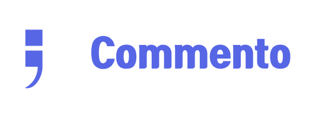

# 프로젝트 이름 및 소개
  

<b>코멘토(Comento)</b> : 코딩을 입문하는 사람이나 코딩 도중에 어려움을 겪는 사람들을 위한 서비스로, Coding + Mento == Comento입니다.

## 🛠️ 기능 및 프로세스 과정 요약
1. 질문자가 질문 내용이나 자료에 관한 내용을 게시
2. 해당 내용에 도움을 줄 수 있는 멘토가 질문을 승낙
3. 채팅을 통해 멘토(답변자)와 멘티(질문자)가 대화하여 해당 문제를 같이 해결
 

## ⏰ 개발 기간
1️⃣차 개발기간 : 2022년 7월 1일 ~ 2022년 8월 28일

## 👩‍💻 멤버 구성 
- Developer 
Leader: 송진영  
Member: 유정호, 김동연, 서지연, 강보영, 정우재, 장재균  
- Design 
Member: 김민아, 신예빈  
- Management  
Member: 도원희, 노연이   
## :computer: 코멘토가 필요한 이유

### 프로그래밍 입문자의 증가
코딩의 중요성이 알려지면서 코딩 관련 강의가 대학 필수 교양으로 편성되는 사례가 많아졌습니다.   그에 따라 자연스레 많은 사람들이 프로그래밍을 입문하고, 
그 과정에서 어려움을 겪는 상황을 빈번하게 확인할 수 있습니다.  이때 사용자가 겪는 어려움을 정확하게 설명해주고 해결해줄 멘토와 매칭하여
해당 문제를 해결할 수 있도록 돕고자 하는 서비스입니다.

  

## :busts_in_silhouette: 서비스 사용 대상
[1] 프로그래밍을 처음 입문하는 사람 
[2] 특정 프레임워크나 언어를 처음 다루면서 어려움을 느끼는 사람 
[3] 디버깅이 익숙하지 않아 코드의 잘못된 부분을 찾는데에 어려움을 느끼는 사람

 

## 사용한 프레임워크(FrameWork)
- FE : <b> React.js</b> 
  

- BE : <b> Node.js </b> 
  

#### UI/UX 및 Wireframe 링크
피그마 링크: [Figma](https://www.figma.com/file/eu6TdzgDWUbj1ZUTUbLZcT/%EC%B4%88%EC%95%88?node-id=0%3A1)
